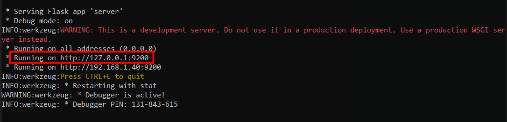
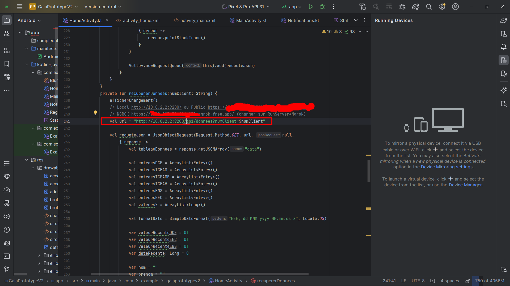

## Lancement du Serveur Python et Client Android

### Requis
- Python 3.X.X
- Clé API chez [Openweathermap.org](https://openweathermap.org/)
- Base de données locale (projetgaia.sql importée dans XAMPP, le fichier SQL est fourni)
- Android Studio

### Lancement

1. **Serveur local**
  
- Ouvrir un cmd à l'endroit où se trouve le `server.py`
- Lancer `runServerLocal.bat` ce qui fera l'installation des librairies de `requirements.txt` et lancera le serveur Flask
- Utiliser le `PORT` (par défaut 9200, sauf modification) que Flask retourne pour l'implémenter dans Android Studio

Exemple : 

2. **Client Android**

- Ouvrir le projet Android Studio avec l'API 31 (modifiable) et changer les IP/port dans les fichiers `HomeActivity.kt` (page d'accueil), `MainActivity.kt` (page de connexion), `Statistique.kt` (page des statistiques)
- Par défaut, c'est `10.0.2.2:9200` (10.0.2.2 est un tunnel vers 127.0.0.1 car l'émulateur Android Studio utilise déjà 127.0.0.1) 
- Lancer le projet

